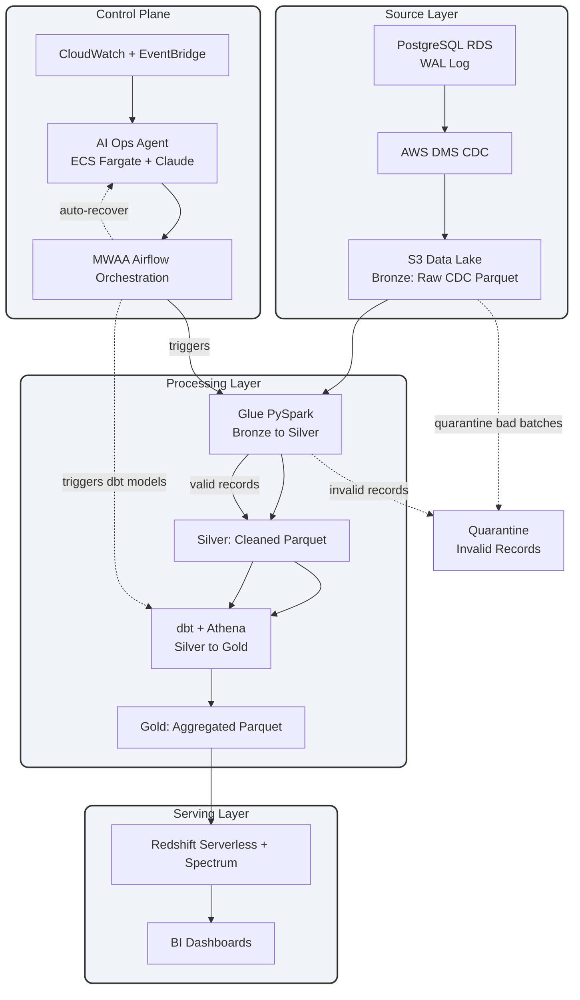
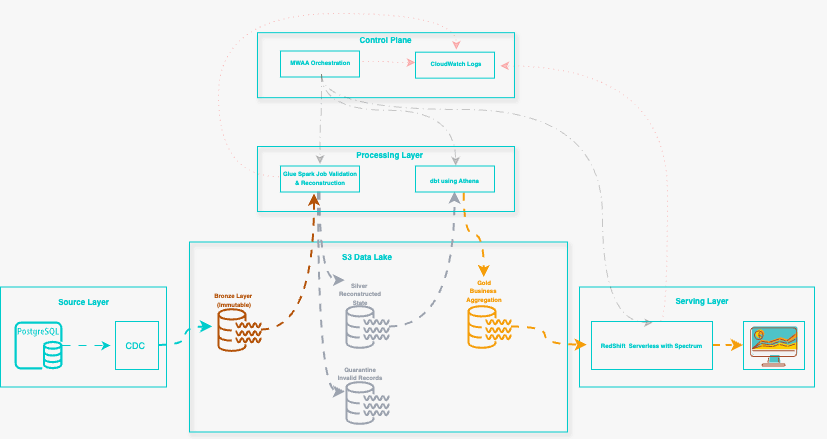

# Hi, I'm Edeh Emeka N.

Data and Platform Engineer focused on building reliable and scalable data platforms on AWS and GCP. I care a lot about automation and infrastructure as code.

I enjoy designing systems from start to finish - real-time streaming, batch analytics, data transformation, orchestration, and analytics. Before moving into data engineering, I spent six years in real estate, which helps me bring real business understanding to technical problems.

---

## Enterprise Data Platform

Right now I design and run a complete production-grade data platform on AWS. All the main pieces live together in my dedicated GitHub organization:

[enterprise-data-platform-emeka](https://github.com/enterprise-data-platform-emeka)

### Main Repositories
These projects work together as one system:

- [terraform-platform-infra-live](https://github.com/enterprise-data-platform-emeka/terraform-platform-infra-live) - Full AWS infrastructure including VPC, S3, Glue, Redshift, MWAA, and IAM
- [platform-orchestration-mwaa-airflow](https://github.com/enterprise-data-platform-emeka/platform-orchestration-mwaa-airflow) - Airflow DAGs for orchestration
- [platform-glue-jobs](https://github.com/enterprise-data-platform-emeka/platform-glue-jobs) - Bronze to Silver Spark ETL jobs
- [platform-dbt-analytics](https://github.com/enterprise-data-platform-emeka/platform-dbt-analytics) - Silver to Gold dbt transformations
- [platform-cdc-simulator](https://github.com/enterprise-data-platform-emeka/platform-cdc-simulator) - CDC event generator

[View the full organization](https://github.com/orgs/enterprise-data-platform-emeka/repositories)

### High-Level Architecture

### How the Platform Works

This shows the complete data flow from source systems through the processing layers all the way to the serving layer with Redshift and BI dashboards.

---

## Featured Public Projects

I also have several public repositories that show my work across different tools and domains:

- Databricks Asset Bundles + Real Estate Pipeline: End-to-end ELT on GCP with Delta Live Tables and medallion architecture
- Real Estate Valuation Pipeline: Built with dbt Fusion, Snowflake, and AWS S3
- Airflow + dbt + BigQuery Healthcare Pipeline: Full orchestration and transformation on Google Cloud
- AWS Terraform Data Platform: Infrastructure as code for S3 data lake, Glue, Athena, and CI/CD
- Fraud Detection and Sales Analytics Pipelines: Using dbt, Snowflake, and Tableau

These projects support what I do in my main enterprise platform and show how I apply modern data engineering in practice.

---

## Skills and Tools
- Pipelines and Processing: dbt, Apache Kafka, Databricks, Glue, Spark
- Cloud and Infrastructure: AWS (S3, Glue, Athena, Redshift, IAM), Terraform, GCP
- Orchestration: Apache Airflow (MWAA), GitHub Actions
- Languages: Python, SQL
- Visualization: Power BI, Tableau, Looker, QuickSight

## Expertise
- Building layered data platforms (raw, curated, and analytics layers)
- Streaming and batch ELT workflows
- Infrastructure as code with proper CI/CD
- Automation and reliability at scale
- Using domain knowledge to solve real business problems

---

Visit my YouTube channel to see project demos: [@Data_Pipeline_Lab](https://www.youtube.com/@Data_Pipeline_Lab)

