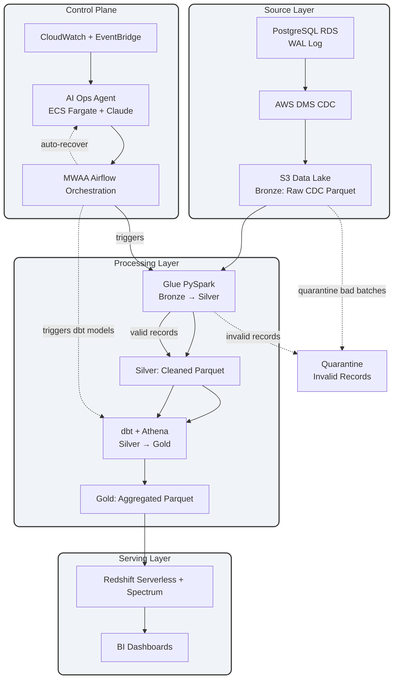

# Hi, I'm Edeh Emeka N.

**Data & Platform Engineer** | Building reliable, scalable production data platforms on AWS & GCP with a strong focus on automation and infrastructure as code.

I design systems end-to-end — from real-time streaming and ingestion through transformation, orchestration, governance, and analytics — while bringing practical business context from six years in real estate.

---

## 🏗️ Enterprise Data Platform

I currently design and operate a **complete, modular production-grade data platform** on AWS. All core components are managed in my dedicated organization:

**[enterprise-data-platform-emeka](https://github.com/enterprise-data-platform-emeka)**

### Key Interconnected Repositories
These repositories are highly dependent on each other and together form an end-to-end modern data platform:

- **[terraform-platform-infra-live](https://github.com/enterprise-data-platform-emeka/terraform-platform-infra-live)** — Full AWS infrastructure (VPC, S3, Glue, Redshift, MWAA, IAM, Endpoints, etc.)
- **[platform-orchestration-mwaa-airflow](https://github.com/enterprise-data-platform-emeka/platform-orchestration-mwaa-airflow)** — Airflow DAGs for reliable orchestration
- **[platform-glue-jobs](https://github.com/enterprise-data-platform-emeka/platform-glue-jobs)** — Bronze → Silver Spark ETL jobs
- **[platform-dbt-analytics](https://github.com/enterprise-data-platform-emeka/platform-dbt-analytics)** — Silver → Gold dbt transformations
- **[platform-cdc-simulator](https://github.com/enterprise-data-platform-emeka/platform-cdc-simulator)** — OLTP schema & CDC event generator
- **[platform-docs](https://github.com/enterprise-data-platform-emeka/platform-docs)** — Architecture diagrams and teaching material

🔗 **[View all repositories →](https://github.com/enterprise-data-platform-emeka/repositories)**

### High-Level Architecture

---

## 💻 Core Skills & Tools
- **Pipelines & Processing**: dbt, Apache Kafka, Databricks, Glue, Spark
- **Cloud & IaC**: AWS (S3, Glue, Athena, Redshift, IAM), **Terraform**, GCP
- **Orchestration**: Apache Airflow (MWAA), GitHub Actions
- **Languages**: Python, SQL
- **Visualization**: Power BI, Tableau, Looker, QuickSight

## 🌟 Expertise
- Layered data platform architecture (raw → curated → analytics)
- Kafka streaming + dbt-driven ELT workflows
- Terraform infrastructure with remote state & CI/CD
- Automation, testing, and reliability at platform scale
- Business-aligned data solutions with strong domain context

---

Visit my YouTube channel for project demonstrations: [@Data_Pipeline_Lab](https://www.youtube.com/@Data_Pipeline_Lab)

