---

# Edeh Emeka N.

Data Platform Engineer building end-to-end analytics systems across AWS, GCP, and Databricks.

I design and ship data platforms from infrastructure through stakeholder access: ingestion, transformation, orchestration, serving, observability, and CI/CD. My core stack is PySpark, dbt, Airflow, Kafka, Terraform, AWS, GCP, Python, and SQL.

- 4 years building end-to-end data pipelines
- strongest in cloud data platforms, CDC, medallion architecture, and analytics engineering
- interested in data engineering, platform engineering, analytics engineering, and applied AI data products

---

## Flagship Build: Enterprise Data Platform

I built a multi-repo AWS data platform that takes raw PostgreSQL change events and turns them into business-ready analytics accessible through plain-English questions in a browser or Slack.

**Organisation:** [`enterprise-data-platform-emeka`](https://github.com/enterprise-data-platform-emeka)

### Architecture Scope

- PostgreSQL RDS source with AWS DMS CDC into S3 Bronze
- 6 parallel AWS Glue PySpark jobs to reconcile CDC records into Silver
- 15 dbt models on Athena to build the Gold layer
- Redshift Serverless serving path for downstream analytics
- FastAPI + Streamlit analytics agent on ECS Fargate
- Slack gateway for stakeholder access through chat
- Terraform-managed infrastructure split across 9 modules
- Step Functions default orchestration, with MWAA as an Airflow-based alternative

### Production-Minded Design

- private networking, encryption, and IAM least privilege
- data quality checks and validation between layers
- CloudWatch dashboards and alarms across pipeline and serving components
- request tracing and audit logging in the analytics agent
- cost-aware design for short-lived full-stack sessions and low-cost pipeline runs

### Selected Implementation Details

- full pipeline run completes in about 10-12 minutes via Step Functions
- MWAA path is also implemented for Airflow-native orchestration and visual task tracing
- analytics agent answers plain-English questions with generated SQL, chart output, and plain-English insights
- per-session platform cost is kept to roughly $1.50-$2.50 for a 2-3 hour run

```mermaid
flowchart LR
    classDef source fill:#e0f2fe,stroke:#0284c7,color:#0f172a,stroke-width:2px
    classDef bronze fill:#fef3c7,stroke:#d97706,color:#78350f,stroke-width:2px
    classDef silver fill:#e2e8f0,stroke:#64748b,color:#0f172a,stroke-width:2px
    classDef gold fill:#fef9c3,stroke:#ca8a04,color:#713f12,stroke-width:2px
    classDef serve fill:#dcfce7,stroke:#16a34a,color:#14532d,stroke-width:2px
    classDef access fill:#d1fae5,stroke:#059669,color:#064e3b,stroke-width:2px
    classDef control fill:#ede9fe,stroke:#7c3aed,color:#4c1d95,stroke-width:2px
    classDef monitor fill:#fee2e2,stroke:#dc2626,color:#7f1d1d,stroke-width:2px
    classDef quarantine fill:#ffe4e6,stroke:#e11d48,color:#881337,stroke-width:2px

    subgraph SRC["Source Layer"]
        PG["PostgreSQL RDS<br/>orders, customers, payments, shipments"]:::source
        DMS["AWS DMS<br/>full load + CDC"]:::source
    end

    subgraph LAKE["S3 Data Lake"]
        BRZ["Bronze S3<br/>immutable CDC parquet"]:::bronze
        SLV["Silver S3<br/>reconciled star schema"]:::silver
        GLD["Gold S3<br/>business marts on Athena"]:::gold
        QTN["Quarantine S3<br/>invalid records + error reason"]:::quarantine
    end

    subgraph PROC["Processing Layer"]
        GLUE["AWS Glue PySpark<br/>6 parallel Bronze -> Silver jobs"]:::silver
        CRAWLER["Glue Crawler<br/>catalog + partitions"]:::silver
        DBT["dbt on Athena<br/>15 models + tests"]:::gold
    end

    subgraph CTRL["Control Plane"]
        SF["Step Functions<br/>default daily orchestrator"]:::control
        MWAA["MWAA Airflow<br/>alternative orchestrator"]:::control
        GHA["GitHub Actions<br/>CI/CD and session workflows"]:::control
    end

    subgraph SERVE["Serving Layer"]
        RS["Redshift Serverless<br/>Spectrum external tables"]:::serve
        API["Analytics Agent API<br/>FastAPI on ECS Fargate"]:::serve
        UI["Streamlit UI<br/>browser access"]:::access
        SLACK["Slack MCP Gateway<br/>chat access"]:::access
    end

    subgraph OBS["Observability"]
        CW["CloudWatch<br/>dashboards, alarms, logs"]:::monitor
        AUDIT["S3 audit trail<br/>request logs + artifacts"]:::monitor
    end

    PG --> DMS --> BRZ
    BRZ --> GLUE
    GLUE --> SLV
    GLUE -. invalid records .-> QTN
    SLV --> CRAWLER --> DBT --> GLD
    GLD --> RS
    GLD --> API
    API --> UI
    API --> SLACK

    SF -. orchestrates .-> GLUE
    SF -. orchestrates .-> CRAWLER
    SF -. orchestrates .-> DBT
    MWAA -. orchestrates .-> GLUE
    MWAA -. orchestrates .-> CRAWLER
    MWAA -. orchestrates .-> DBT
    GHA -. deploys .-> SF
    GHA -. deploys .-> MWAA
    GHA -. deploys .-> API

    GLUE -. metrics/logs .-> CW
    DBT -. test results .-> CW
    RS -. query serving .-> CW
    API -. app logs .-> CW
    API -. request trace .-> AUDIT
    DBT -. manifest/catalog .-> AUDIT
```

### Key Repositories

| Repository | Purpose |
|---|---|
| [`platform-docs`](https://github.com/enterprise-data-platform-emeka/platform-docs) | Full build guide, architecture, engineering decisions, and hardening roadmap |
| [`terraform-platform-infra-live`](https://github.com/enterprise-data-platform-emeka/terraform-platform-infra-live) | AWS infrastructure for networking, storage, processing, serving, and orchestration |
| [`platform-glue-jobs`](https://github.com/enterprise-data-platform-emeka/platform-glue-jobs) | Bronze to Silver PySpark jobs with CDC reconciliation and data validation |
| [`platform-dbt-analytics`](https://github.com/enterprise-data-platform-emeka/platform-dbt-analytics) | Silver to Gold dbt models on Athena |
| [`platform-analytics-agent`](https://github.com/enterprise-data-platform-emeka/platform-analytics-agent) | FastAPI and Streamlit analytics agent with NL-to-SQL workflow |
| [`platform-orchestration-mwaa-airflow`](https://github.com/enterprise-data-platform-emeka/platform-orchestration-mwaa-airflow) | Airflow DAG implementation of the end-to-end pipeline |

[View the full organization](https://github.com/orgs/enterprise-data-platform-emeka/repositories)

---

## Selected Public Projects

I use public projects to explore different platform shapes, warehouses, and cloud stacks:

| Project | Stack | What it demonstrates |
|---|---|---|
| [Databricks_Asset_Bundles_Real_Estate_Data_Pipeline_Youtube](https://github.com/ChuquEmeka/Databricks_Asset_Bundles_Real_Estate_Data_Pipeline_Youtube) | Databricks, Delta Live Tables, GCP | Medallion architecture for real estate analytics |
| [real_estate_valuation_dbt_fusion_snowflake_aws_pipeline](https://github.com/ChuquEmeka/real_estate_valuation_dbt_fusion_snowflake_aws_pipeline) | dbt Fusion, Snowflake, S3 | Multi-source valuation pipeline with Snowflake serving |
| [Airflow-dbt-bigquery-gcs-healthcare-data-pipeline](https://github.com/ChuquEmeka/Airflow-dbt-bigquery-gcs-healthcare-data-pipeline) | Airflow, dbt, BigQuery, GCS | Orchestration and transformation on Google Cloud |
| [DBT-Fraud-Detection-Data-Pipeline](https://github.com/ChuquEmeka/DBT-Fraud-Detection-Data-Pipeline) | dbt, Snowflake | Fraud analytics pipeline and warehouse modeling |
| [End-to-End-Data-Pipeline-Snowflake-dbt-Tableau](https://github.com/ChuquEmeka/End-to-End-Data-Pipeline-Snowflake-dbt-Tableau) | Snowflake, dbt, Tableau | End-to-end analytics workflow from ingestion to BI |

---

## What I Focus On

- end-to-end data platform ownership
- CDC and event-driven ingestion patterns
- medallion architecture and warehouse modeling
- infrastructure as code and GitHub Actions CI/CD
- observability, guardrails, and operational reliability
- analytics products that make data easier to use

---

## Core Tools

---

## Contribution Activity

  

