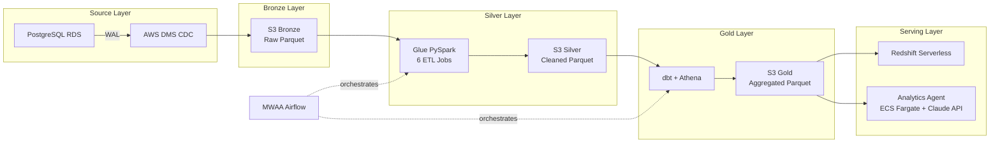

 

I build production-grade data platforms end-to-end. 
**PostgreSQL CDC → Bronze → PySpark → Silver → dbt → Gold → Redshift → AI Analytics Agent**

 

Six years in real estate before engineering. I bring real business context to technical decisions.

 

---

## GitHub Stats

  
  

  

---

## Tools & Technologies

**Cloud & Infrastructure**

**Data Processing & Transformation**

**Orchestration & Serving**

**Languages & BI**

---

## Enterprise Data Platform

A complete production-grade AWS data platform built as a single coherent system.
All source, infrastructure, and application code lives in a dedicated GitHub organisation.

**Organisation:** [enterprise-data-platform-emeka](https://github.com/enterprise-data-platform-emeka)

| Repository | What it does |
|---|---|
| [terraform-platform-infra-live](https://github.com/enterprise-data-platform-emeka/terraform-platform-infra-live) | All AWS infrastructure across 9 Terraform modules: VPC, S3, Glue, Redshift, MWAA, ECS Fargate, Step Functions, and monitoring |
| [platform-analytics-agent](https://github.com/enterprise-data-platform-emeka/platform-analytics-agent) | Natural language → SQL → chart and insight via Claude API on ECS Fargate with FastAPI and Streamlit |
| [platform-glue-jobs](https://github.com/enterprise-data-platform-emeka/platform-glue-jobs) | PySpark Bronze to Silver ETL across 6 parallel Glue jobs |
| [platform-dbt-analytics](https://github.com/enterprise-data-platform-emeka/platform-dbt-analytics) | dbt Silver to Gold models with data quality tests on Athena |
| [platform-orchestration-mwaa-airflow](https://github.com/enterprise-data-platform-emeka/platform-orchestration-mwaa-airflow) | Airflow DAGs deployed on Amazon MWAA |
| [platform-cdc-simulator](https://github.com/enterprise-data-platform-emeka/platform-cdc-simulator) | PostgreSQL CDC event generator for end-to-end pipeline testing |

<b>View architecture diagram</b>

 

---

## Other Projects

| Project | Stack | What it demonstrates |
|---|---|---|
| [Real Estate ELT Pipeline](https://github.com/ChuquEmeka/Databricks_Asset_Bundles_Real_Estate_Data_Pipeline_Youtube) | Databricks, Delta Live Tables, GCP | Medallion architecture with streaming ingestion on GCP |
| [Real Estate Valuation Pipeline](https://github.com/ChuquEmeka/real_estate_valuation_dbt_fusion_snowflake_aws_pipeline) | dbt Fusion, Snowflake, S3 | Multi-source transformation with Snowflake as the serving layer |
| [Healthcare Analytics Pipeline](https://github.com/ChuquEmeka/Airflow-dbt-bigquery-gcs-healthcare-data-pipeline) | Airflow, dbt, BigQuery, GCS | Full orchestration and transformation on Google Cloud |
| [Fraud Detection Pipeline](https://github.com/ChuquEmeka/DBT-Fraud-Detection-Data-Pipeline) | dbt, Snowflake | End-to-end analytics pipeline with dbt data modelling |
| [End-to-End Snowflake Pipeline](https://github.com/ChuquEmeka/End-to-End-Data-Pipeline-Snowflake-dbt-Tableau) | Snowflake, dbt, Tableau | Full pipeline from ingestion to Tableau BI dashboard |

---

**Watch pipeline demos and tutorials on my YouTube channel**

